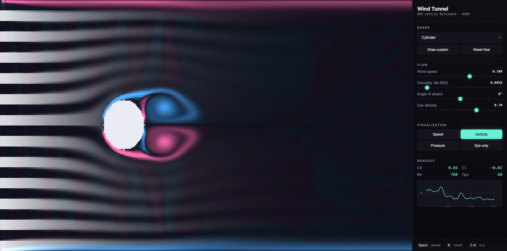

# Wind Tunnel

Real-time, browser-based GPU wind tunnel simulator. **Drop in shapes, watch the flow.**



## What it is

A 2D D2Q9 **Lattice Boltzmann** fluid solver running entirely in WebGL2 fragment shaders, with:

- **6 preset shapes** — cylinder, square, NACA 0012 / 2412 airfoils, teardrop, flat plate
- **Free-draw mode** — sketch any closed polygon, sim flows around it
- **4 visualizations** — velocity, vorticity, pressure, dye streamlines
- **Live drag/lift readout** — momentum-exchange forces on the body, with rolling C_d graph
- **Real-time controls** — wind speed, viscosity (Reynolds number), angle of attack, dye density

Rendered at 384×192 lattice cells; **60 fps** on a modern laptop GPU; **163 KB gzipped** total bundle (incl. Three.js).

## How it works

- **D2Q9** lattice (9 discrete velocities per cell) stored across 3 RGBA32F render targets via MRT
- **BGK collision** + fused streaming pass via offsetted `texelFetch`
- **Half-way bounce-back** on obstacle boundaries (cell-classification mask, à la Zhou 2019)
- **Zou-He inlet**, zero-gradient outlet, no-slip top/bottom walls
- **Semi-Lagrangian** dye advection driven by the LBM velocity field, with linear-filtered RGBA16F dye texture
- **Force readback** via GPU 4× pyramid reduction → async `readPixels` every 4 frames

## Inspiration & credit

This project's solver structure follows the cell-classification approach from Xinhuan Zhou's PhD work on GPU LBM CFD — see [Xinhuan-Imperial/Lattice-Boltzmann-Method-GPU](https://github.com/Xinhuan-Imperial/Lattice-Boltzmann-Method-GPU). Their thesis (Chapter 4) is an excellent reference for the boundary-condition machinery.

## Run locally

```bash
npm install
npm run dev
```

## Stack

- TypeScript · Vite 8 · Three.js (r0.184) · WebGL2 · GLSL ES 3.00
- uPlot for the live force chart

## License

MIT
